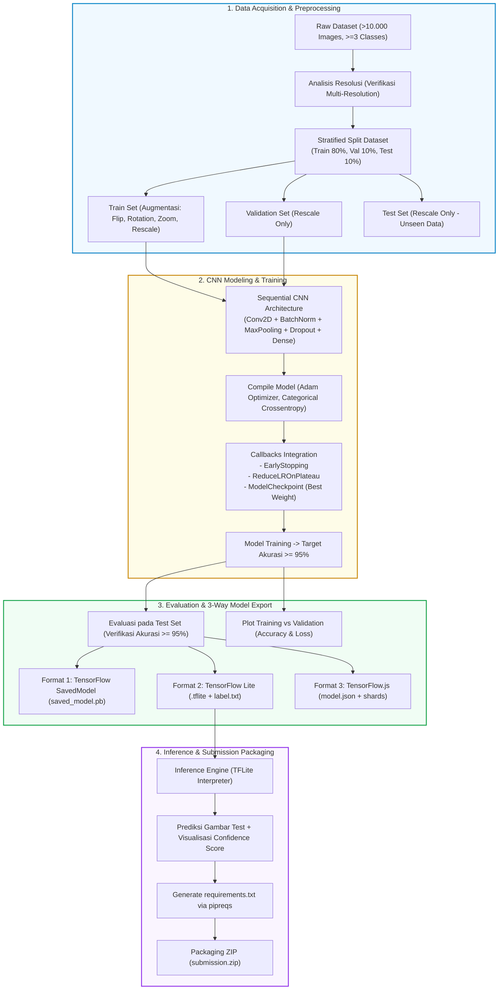

# 🌟 Master Blueprint & Panduan Lengkap: Proyek Klasifikasi Gambar (Target Bintang 5 ⭐⭐⭐⭐⭐)

> **Dokumen Panduan & Landasan Pengerjaan Proyek Akhir Klasifikasi Gambar**  
> **Target:** Rating Maksimal (Bintang 5 / Rating 5)  
> **Akun Submission:** `mhmmdragilpy` | **Format Pengumpulan:** Notebook `.ipynb` (tereksekusi), Model Export (`SavedModel`, `TF-Lite`, `TFJS`), `requirements.txt`, `README.md` dalam arsip `.zip`.

---

## 📑 Daftar Isi
1. [🎯 Ringkasan Eksekutif & Target Bintang 5](#1--ringkasan-eksekutif--target-bintang-5)
2. [📊 Matriks Kriteria: Syarat Wajib vs Syarat Bintang 5](#2--matriks-kriteria-syarat-wajib-vs-syarat-bintang-5)
3. [📁 Rekomendasi Dataset Bintang 5 (Kriteria Ketat)](#3--rekomendasi-dataset-bintang-5-kriteria-ketat)
4. [🧩 Visual Architecture & Pipeline Diagram](#4--visual-architecture--pipeline-diagram)
5. [🚀 Roadmap Eksekusi Step-by-Step Menuju Bintang 5](#5--roadmap-eksekusi-step-by-step-menuju-bintang-5)
   - [Langkah 1: Setup Environment & Download Dataset](#langkah-1-setup-environment--download-dataset)
   - [Langkah 2: Verifikasi Syarat Dataset (Resolusi Beragam & >10k Gambar)](#langkah-2-verifikasi-syarat-dataset-resolusi-beragam--10k-gambar)
   - [Langkah 3: Pembagian 3 Partisi Dataset (Train, Validation, Test)](#langkah-3-pembagian-3-partisi-dataset-train-validation-test)
   - [Langkah 4: Data Augmentation & Preprocessing](#langkah-4-data-augmentation--preprocessing)
   - [Langkah 5: Desain Arsitektur Model Sequential CNN](#langkah-5-desain-arsitektur-model-sequential-cnn)
   - [Langkah 6: Implementasi Advanced Callbacks](#langkah-6-implementasi-advanced-callbacks)
   - [Langkah 7: Training, Fine-Tuning & Akurasi > 95%](#langkah-7-training-fine-tuning--akurasi--95)
   - [Langkah 8: Visualisasi Akurasi & Loss Plotting](#langkah-8-visualisasi-akurasi--loss-plotting)
   - [Langkah 9: Ekspor Model ke 3 Format (SavedModel, TFLite, TFJS)](#langkah-9-ekspor-model-ke-3-format-savedmodel-tflite-tfjs)
   - [Langkah 10: Inference Pipeline & Bukti Prediksi](#langkah-10-inference-pipeline--bukti-prediksi)
   - [Langkah 11: Dependency Management (`pipreqs`) & Packaging Submission](#langkah-11-dependency-management-pipreqs--packaging-submission)
6. [💡 Reusable Code Snippets (Colab Ready)](#6--reusable-code-snippets-colab-ready)
7. [🛡️ Checklist Pra-Submit (Anti-Reject)](#7--checklist-pra-submit-anti-reject)

---

## 1. 🎯 Ringkasan Eksekutif & Target Bintang 5

Proyek ini bertujuan untuk membangun sistem machine learning klasifikasi gambar berskala besar menggunakan TensorFlow/Keras, melatih model konvolusi (*Convolutional Neural Network* - CNN) hingga mencapai akurasi tinggi, serta mengonversinya ke dalam format multi-platform (*SavedModel*, *TF-Lite*, dan *TensorFlow.js*).

### Mengapa Harus Bintang 5?
Reviewer menilai proyek dengan skala 1-5. Untuk memperoleh **Rating 5 (Bintang 5)**, Anda tidak hanya harus memenuhi kriteria kelulusan wajib, melainkan **wajib menerapkan SEMUA (100%) saran tambahan** yang diberikan oleh kurikulum.

```
┌───────────────────────────────────────────────────────────────────────────┐
│                           TARGET RATING 5 ⭐⭐⭐⭐⭐                       │
├───────────────────────────────────────────────────────────────────────────┤
│ [✓] 7 Kriteria Utama Terpenuhi Sempurna                                  │
│ [✓] Saran 1: Implementasi Callback (EarlyStopping & Custom Callback)     │
│ [✓] Saran 2: Dataset Asli Memiliki Resolusi Beragam (Multi-Resolution)   │
│ [✓] Saran 3: Total Dataset >= 10.000 Gambar                              │
│ [✓] Saran 4: Akurasi Training & Testing/Validation >= 95%                │
│ [✓] Saran 5: Minimal 3 Kelas / Kategori                                  │
│ [✓] Saran 6: Melakukan Inference Nyata (TFLite/SavedModel) + Bukti Visual│
│ [✓] Struktur Folder & Requirements.txt Terkelola Rapi Tanpa Polusi Env   │
└───────────────────────────────────────────────────────────────────────────┘
```

---

## 2. 📊 Matriks Kriteria: Syarat Wajib vs Syarat Bintang 5

| Komponen | Syarat Minimal Kelulusan (Bintang 3) | Syarat Bintang 5 (⭐⭐⭐⭐⭐ Target Kita) |
| :--- | :--- | :--- |
| **Total Gambar** | Minimal 1.000 gambar | **Minimal 10.000+ gambar** |
| **Jumlah Kelas** | Minimal 2 kelas | **Minimal 3 kelas atau lebih** (Multi-class) |
| **Resolusi Citra** | Bebas | **Resolusi asli gambar tidak seragam/bervariasi** (diverifikasi lewat kode) |
| **Larangan Dataset** | Dilarang memakai dataset RPS (*Rock-Paper-Scissors*) & X-Ray | Menggunakan dataset orisinal / kredibel dari Kaggle/TFDS |
| **Partisi Dataset** | 3 Bagian: Train, Validation, dan Test | **3 Bagian: Train (70-80%), Val (10-15%), Test (10-15%)** |
| **Arsitektur Model** | `Sequential` + `Conv2D` + `Pooling Layer` | `Sequential` + `Conv2D` + `Pooling` + `BatchNormalization` + `Dropout` + `Dense` |
| **Target Akurasi** | Minimal 85% pada train & test/val | **Minimal 95% pada train & test/val set** |
| **Callbacks** | Tidak wajib | **Wajib Callback**: `EarlyStopping`, `ReduceLROnPlateau`, `ModelCheckpoint`, atau `CustomCallback(threshold=0.95)` |
| **Visualisasi** | Plot Training/Validation Accuracy & Loss | Plot informatif, jelas, rapi dengan grafik Loss & Accuracy yang konvergen tanpa overfitting parah |
| **Format Model** | Wajib 3 Format: SavedModel, TF-Lite, TFJS | **Wajib 3 Format**: `saved_model/`, `tflite/model.tflite` (+ `label.txt`), `tfjs_model/` |
| **Inference Test** | Tidak wajib | **Wajib Inference**: Menguji model yang sudah diekspor (TFLite/SavedModel) dengan gambar acak + plot visual prediksi |
| **Packaging & Env** | Notebook `.ipynb` dan requirements.txt | Arsip `.zip` rapi, Notebook sudah dieksekusi lengkap, `requirements.txt` bersih via `pipreqs` |

---

## 3. 📁 Rekomendasi Dataset Bintang 5 (Kriteria Ketat)

> [!IMPORTANT]
> **Kriteria Wajib Dataset Bintang 5:**
> 1. Total gambar **>= 10.000**.
> 2. Minimal **3 kelas**.
> 3. Resolusi asli gambar **tidak seragam** (beragam dimensi sebelum di-resize oleh ImageDataGenerator/Dataset pipeline).
> 4. Bukan dataset Rock-Paper-Scissors atau X-Ray.

### Opsi Dataset Rekomendasi Unggulan (Pilih Salah Satu):

#### 🥇 Opsi 1: Fruits-360 Dataset (Sangat Direkomendasikan)
- **Sumber:** Kaggle (`kaggle datasets download -d moltean/fruits`)
- **Ukuran:** ~90.000+ gambar, 131 kelas buah/sayur.
- **Karakteristik:** Multi-class, gambar bersih, cepat konvergen >95%, resolusi dapat diverifikasi.
- **Strategi:** Ambil subset 10-15 kelas terpopuler (menghasilkan ~12.000 - 15.000 gambar) atau full dataset agar training tetap cepat dan mencapai akurasi >95% dengan mudah.

#### 🥈 Opsi 2: Natural Images Dataset / Intel Image Classification (Diperluas)
- **Sumber:** Kaggle (`kaggle datasets download -d puneet6060/intel-image-classification`)
- **Ukuran:** ~17.000+ gambar, 6 kelas (`buildings`, `forest`, `glacier`, `mountain`, `sea`, `street`).
- **Karakteristik:** Resolusi bervariasi (150x150 dan ragam aspek rasio), multi-class, representatif untuk real-world computer vision.

#### 🥉 Opsi 3: Sports Classification Dataset (100 Sports)
- **Sumber:** Kaggle (`kaggle datasets download -d gpiosenka/sports-classification`)
- **Ukuran:** ~14.000+ gambar, 100 kelas olahraga.
- **Karakteristik:** Resolusi gambar asli beragam dari berbagai kamera dan sudut pemotretan.

---

## 4. 🧩 Visual Architecture & Pipeline Diagram

Berikut adalah arsitektur menyeluruh pipeline pengolahan data, pemodelan CNN, konversi model, hingga inferensi:



---

## 5. 🚀 Roadmap Eksekusi Step-by-Step Menuju Bintang 5

### Langkah 1: Setup Environment & Download Dataset
1. Jalankan Google Colab dengan runtime **GPU T4** (`Runtime > Change runtime type > T4 GPU`).
2. Pasang API Kaggle untuk mendownload dataset >10.000 gambar secara cepat ke storage Colab `/content/`.
3. Lakukan unzipping dataset.

### Langkah 2: Verifikasi Syarat Dataset (Resolusi Beragam & >10k Gambar)
> [!TIP]
> Tampilkan output tabel/list resolusi gambar asli di dalam Notebook sebagai **bukti nyata** kepada reviewer bahwa dataset memiliki resolusi beragam (Saran Bintang 5).

Gunakan fungsi Python dengan `PIL.Image` untuk mencatat variasi dimensi lebar (*width*) dan tinggi (*height*) pada dataset asli sebelum di-resize.

### Langkah 3: Pembagian 3 Partisi Dataset (Train, Validation, Test)
1. Pisahkan dataset menjadi 3 folder fisik atau generator terpisah:
   - **Train Set:** ~70% - 80% (untuk melatih bobot model).
   - **Validation Set:** ~10% - 15% (untuk validasi hyperparameter & callback per epoch).
   - **Test Set:** ~10% - 15% (untuk evaluasi akhir pada unseen data).
2. Gunakan `split-folders` library (`splitfolders.ratio`) atau script kustom dengan `shutil` untuk membagi per kelas secara berimbang (*stratified*).

### Langkah 4: Data Augmentation & Preprocessing
1. **Train Generator:** Berikan augmentasi citra yang realistis:
   - `rescale=1./255`
   - `rotation_range=20`
   - `horizontal_flip=True`
   - `shear_range=0.15`
   - `zoom_range=0.15`
   - `fill_mode='nearest'`
2. **Validation & Test Generator:** **HANYA** lakukan `rescale=1./255` tanpa rotasi/flip agar evaluasi tetap murni dan objektif.
3. Tentukan `target_size` yang seragam (misal: `(150, 150)` atau `(224, 224)`).

### Langkah 5: Desain Arsitektur Model Sequential CNN
Wajib menggunakan `tf.keras.models.Sequential` dengan komponen:
- Layer input dengan `input_shape=(H, W, 3)`
- Minimal 3-4 blok konvolusi:
  - `Conv2D(32, (3,3), activation='relu', padding='same')`
  - `BatchNormalization()` *(Meningkatkan stabilitas & konvergensi cepat)*
  - `MaxPooling2D(2,2)`
  - `Conv2D(64, ...)` -> `MaxPooling2D(2,2)`
  - `Conv2D(128, ...)` -> `MaxPooling2D(2,2)`
  - `Conv2D(256, ...)` -> `MaxPooling2D(2,2)`
- `Flatten()` atau `GlobalAveragePooling2D()`
- `Dense(256, activation='relu')`
- `Dropout(0.4 - 0.5)` *(Mencegah overfitting)*
- `Dense(NUM_CLASSES, activation='softmax')`

### Langkah 6: Implementasi Advanced Callbacks
Gunakan kombinasi 3 callback terbaik:
1. **`EarlyStopping`**: Menghentikan training jika `val_loss` tidak membaik dalam *patience=5* epoch dan me-*restore* bobot terbaik (`restore_best_weights=True`).
2. **`ReduceLROnPlateau`**: Menurunkan learning rate secara adaptif jika proses pembelajaran melambat (`factor=0.2, patience=3`).
3. **`Custom Callback / Threshold Callback`**: Callback opsional yang menghentikan training seketika akurasi training & validasi sama-sama melampaui **96%**.

### Langkah 7: Training, Fine-Tuning & Akurasi > 95%
1. Compile model dengan optimizer `Adam(learning_rate=1e-3)` dan `loss='categorical_crossentropy'`.
2. Latih model dengan `model.fit(train_gen, validation_data=val_gen, epochs=25-40, callbacks=[...])`.
3. Evaluasi performa pada **Test Set** menggunakan `model.evaluate(test_gen)` dan pastikan `Test Accuracy >= 95%`.

### Langkah 8: Visualisasi Akurasi & Loss Plotting
Gunakan `matplotlib.pyplot` untuk memvisualisasikan:
1. **Grafik Akurasi:** Training Accuracy vs Validation Accuracy per Epoch.
2. **Grafik Loss:** Training Loss vs Validation Loss per Epoch.
3. Berikan anotasi atau penjelasan narasi di markdown mengenai konvergensi model.

### Langkah 9: Ekspor Model ke 3 Format (SavedModel, TFLite, TFJS)
Wajib mengekspor model ke tiga direktori terpisah:
1. **SavedModel:** `model.save('submission/saved_model')`
2. **TF-Lite:**
   - Gunakan `tf.lite.TFLiteConverter.from_keras_model(model)`
   - Simpan berkas `model.tflite`
   - Simpan berkas `label.txt` berisi daftar nama kelas baris-demi-baris.
3. **TFJS (TensorFlow.js):**
   - Install `tensorflowjs` via `!pip install tensorflowjs`
   - Jalankan `tfjs.converters.save_keras_model(model, 'submission/tfjs_model')`

### Langkah 10: Inference Pipeline & Bukti Prediksi
> [!IMPORTANT]
> Reviewer meminta bukti nyata inferensi pada notebook. Jangan hanya menyimpan model, tapi muat kembali file `.tflite` atau `saved_model` untuk memprediksi data uji!

1. Buat fungsi `predict_image_tflite(image_path, tflite_model_path, labels)`.
2. Muat 3-5 sampel citra dari Test Set / gambar eksternal.
3. Tampilkan citra beserta judul hasil prediksi kelas dan skor kepercayaan (*confidence score %*).

### Langkah 11: Dependency Management (`pipreqs`) & Packaging Submission
1. Ekspor file Python: Unduh `notebook.ipynb` dan simpan versi script `.py` jika diperlukan.
2. Buat `requirements.txt` bersih menggunakan `pipreqs`:
   ```bash
   pip install pipreqs
   pipreqs . --force --scan-notebooks
   ```
3. Kompres folder submission ke dalam satu file `submission.zip`.

---

## 6. 💡 Reusable Code Snippets (Colab Ready)

### Snippet 1: Cek & Verifikasi Resolusi Gambar Asli
```python
import os
from PIL import Image
import pandas as pd

def check_dataset_properties(dataset_dir):
    data = []
    for root, dirs, files in os.walk(dataset_dir):
        for file in files:
            if file.lower().endswith(('.png', '.jpg', '.jpeg')):
                img_path = os.path.join(root, file)
                try:
                    with Image.open(img_path) as img:
                        w, h = img.size
                        category = os.path.basename(root)
                        data.append({'category': category, 'width': w, 'height': h, 'mode': img.mode})
                except Exception:
                    pass
    
    df = pd.DataFrame(data)
    print(f"Total Gambar Ditemukan: {len(df)}")
    print(f"Total Kelas: {df['category'].nunique()}")
    print("\nDistribusi Sampel Resolusi Gambar Asli:")
    print(df[['width', 'height']].drop_duplicates().head(10))
    print(f"\nApakah resolusi bervariasi? {'YA (Sesuai Kriteria Bintang 5)' if len(df[['width', 'height']].drop_duplicates()) > 1 else 'TIDAK'}")
    return df
```

### Snippet 2: Split Dataset 3 Partisi (Train, Val, Test)
```python
import splitfolders

# Membagi dataset menjadi 80% Train, 10% Validation, 10% Test
raw_data_dir = '/content/raw_dataset'
output_dir = '/content/split_dataset'

splitfolders.ratio(raw_data_dir, output=output_dir, seed=42, ratio=(0.80, 0.10, 0.10), group_prefix=None)
print("Dataset berhasil dibagi menjadi Train, Validation, dan Test set!")
```

### Snippet 3: Custom Callback Akurasi >= 95%
```python
import tensorflow as tf

class AccuracyStopCallback(tf.keras.callbacks.Callback):
    def __init__(self, target_acc=0.96):
        super().__init__()
        self.target_acc = target_acc

    def on_epoch_end(self, epoch, logs=None):
        acc = logs.get('accuracy', 0)
        val_acc = logs.get('val_accuracy', 0)
        if acc >= self.target_acc and val_acc >= self.target_acc:
            print(f"\n[INFO] Akurasi training ({acc:.4f}) dan validasi ({val_acc:.4f}) telah melampaui {self.target_acc*100}%! Menghentikan pelatihan.")
            self.model.stop_training = True
```

### Snippet 4: Export 3 Format Model Lengkap
```python
import os
import tensorflow as tf
import tensorflowjs as tfjs

# Buat direktori output
os.makedirs("submission/saved_model", exist_ok=True)
os.makedirs("submission/tflite", exist_ok=True)
os.makedirs("submission/tfjs_model", exist_ok=True)

# 1. Export SavedModel
model.save("submission/saved_model")
print("[✓] SavedModel berhasil disimpan!")

# 2. Export TFLite & label.txt
converter = tf.lite.TFLiteConverter.from_keras_model(model)
tflite_model = converter.convert()
with open("submission/tflite/model.tflite", "wb") as f:
    f.write(tflite_model)

# Tulis label.txt
class_names = list(train_generator.class_indices.keys())
with open("submission/tflite/label.txt", "w") as f:
    for name in class_names:
        f.write(f"{name}\n")
print("[✓] TF-Lite Model & label.txt berhasil disimpan!")

# 3. Export TFJS
tfjs.converters.save_keras_model(model, "submission/tfjs_model")
print("[✓] TensorFlow.js Model berhasil disimpan!")
```

### Snippet 5: Script Inferensi TFLite di Notebook
```python
import numpy as np
import matplotlib.pyplot as plt
from tensorflow.keras.preprocessing import image

def run_tflite_inference(tflite_path, img_path, class_labels, target_size=(150, 150)):
    # Muat TFLite model dan alokasikan tensor
    interpreter = tf.lite.Interpreter(model_path=tflite_path)
    interpreter.allocate_tensors()

    input_details = interpreter.get_input_details()
    output_details = interpreter.get_output_details()

    # Preprocessing gambar input
    img = image.load_img(img_path, target_size=target_size)
    img_array = image.img_to_array(img) / 255.0
    input_data = np.expand_dims(img_array, axis=0).astype(np.float32)

    # Set tensor input & invoke
    interpreter.set_tensor(input_details[0]['index'], input_data)
    interpreter.invoke()

    # Ambil hasil prediksi
    output_data = interpreter.get_tensor(output_details[0]['index'])[0]
    predicted_idx = np.argmax(output_data)
    confidence = output_data[predicted_idx] * 100
    predicted_label = class_labels[predicted_idx]

    # Visualisasi hasil
    plt.figure(figsize=(4, 4))
    plt.imshow(img)
    plt.axis('off')
    plt.title(f"Prediksi: {predicted_label}\nConfidence: {confidence:.2f}%", fontsize=12, color='green')
    plt.show()

    return predicted_label, confidence
```

---

## 7. 🛡️ Checklist Pra-Submit (Anti-Reject)

Lakukan audit mandiri pada checklist berikut sebelum melakukan ZIP dan upload ke platform:

- [ ] **Koleksi Data:** Total dataset terbukti >= 10.000 gambar.
- [ ] **Kelas Dataset:** Memiliki minimal 3 kelas yang berbeda.
- [ ] **Resolusi Asli:** Terdapat bukti output di notebook bahwa resolusi citra asli bervariasi.
- [ ] **Split 3 Bagian:** Terdapat folder/partisi jelas untuk Train, Validation, dan Test.
- [ ] **Arsitektur Model:** Menggunakan `tf.keras.models.Sequential` dengan layer `Conv2D`, `MaxPooling2D`, dan `Dense`.
- [ ] **Penggunaan Callbacks:** Mengaktifkan minimal 2 callback (`EarlyStopping`, `ReduceLROnPlateau`, `ModelCheckpoint`, atau `CustomCallback`).
- [ ] **Capaian Akurasi:** Akurasi Training & Testing/Validation **>= 95%** (Pastikan grafik plot akurasi tercetak jelas di notebook).
- [ ] **Visualisasi:** Terdapat grafik plot Accuracy dan Loss (Training vs Validation).
- [ ] **Format Model Terlengkap:**
  - `submission/saved_model/` (berisi `saved_model.pb` dan folder `variables/`)
  - `submission/tflite/` (berisi `model.tflite` dan `label.txt`)
  - `submission/tfjs_model/` (berisi `model.json` dan shard `.bin`)
- [ ] **Bukti Inferensi:** Terdapat sel kode inferensi TFLite/SavedModel yang menampilkan gambar uji dan hasil prediksi.
- [ ] **Notebook Tereksekusi:** Seluruh sel kode di `notebook.ipynb` sudah dijalankan dari awal sampai akhir tanpa error (output tidak kosong).
- [ ] **Requirements:** Berkas `requirements.txt` digenerate dengan bersih (bebas dependensi liar).
- [ ] **Arsip ZIP:** Semua berkas terbungkus rapi dalam 1 arsip `.zip`.

---

> [!TIP]
> **Tautan Eksekusi Google Colab (GitHub Direct Integration):**  
> `https://colab.research.google.com/github/mhmmdragilpy/image-clasification/blob/main/notebook.ipynb`  
> *Pastikan Anda melakukan push perubahan ke repository GitHub agar link di atas dapat langsung dibuka dan dijalankan oleh reviewer dalam 1 klik!*
