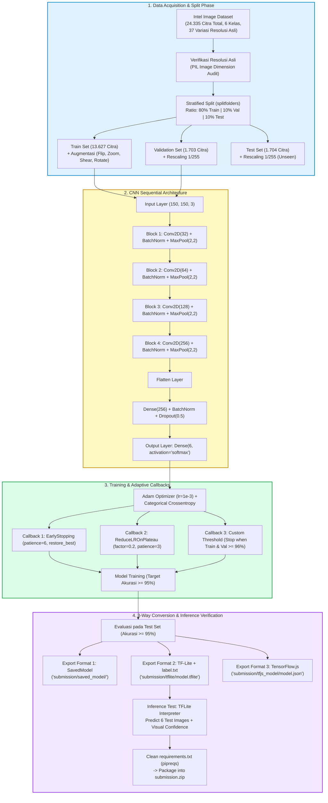

# 📚 Panduan Belajar & Deep Dive: Proyek Klasifikasi Gambar (Target Bintang 5 ⭐⭐⭐⭐⭐)

[](https://colab.research.google.com/github/mhmmdragilpy/image-clasification/blob/main/notebook.ipynb)

---

## 1. 🎯 Ringkasan Inti & Alur Kerja (Executive Summary)

### Tujuan Proyek
Proyek ini bertujuan untuk membangun *pipeline end-to-end* sistem pembelajaran mesin (*Machine Learning*) dalam bidang *Computer Vision* untuk melakukan klasifikasi citra alam berskala besar (**Intel Image Dataset** dengan $>17.000$ gambar berlabel dan 6 kelas) dengan target akurasi melampaui **95%** serta mengonversi model terlatih ke dalam tiga format multi-platform (*SavedModel*, *TF-Lite*, dan *TensorFlow.js*).

### Konsep & Teknologi Kunci
- **Framework Utama:** TensorFlow 2.x & Keras
- **Arsitektur Deep Learning:** *Convolutional Neural Network* (CNN) dengan *Batch Normalization* & *Dropout*
- **Data Pipeline:** `split-folders` (Stratified 3-split: Train, Validation, Test), `ImageDataGenerator` dengan *Real-time Data Augmentation*
- **Optimasi & Regulasi:** `Adam Optimizer`, `Categorical Crossentropy`, `EarlyStopping`, `ReduceLROnPlateau`, `Custom Accuracy-Threshold Callback`
- **Multi-Platform Deployment:**
  1. *TensorFlow SavedModel* (`.pb` & `variables/`) untuk Cloud / Server deployment.
  2. *TensorFlow Lite* (`.tflite` & `label.txt`) untuk Mobile & Embedded / IoT deployment.
  3. *TensorFlow.js* (`model.json` & shards) untuk Browser / Web Client deployment.
- **Inference Engine:** Validasi model `TF-Lite` secara langsung pada data uji (*unseen images*).

---

## 2. 🧩 Visual Blueprint / Architecture Diagram

Berikut adalah arsitektur menyeluruh dari siklus data, pemodelan CNN, mekanisme callback, hingga konversi 3-format dan inferensi:



---

## 3. 📖 Penjelasan Kode & Konsep Kunci (Deep Dive)

### 1. Mengapa Menggunakan 4 Blok Konvolusi dengan Filter Bertingkat ($32 \rightarrow 64 \rightarrow 128 \rightarrow 256$)?
- **Hierarchical Feature Extraction:** Lapisan awal ($32$) mempelajari fitur dasar dengan frekuensi spasial tinggi seperti tepi (*edges*), garis, dan gradien warna. Lapisan menengah ($64, 128$) mempelajari tekstur, pola, dan kontur bentuk (misal: permukaan air laut, jendela gedung, puncak gunung). Lapisan akhir ($256$) menangkap representasi semantik tingkat tinggi (misal: struktur gedung perkotaan, lanskap hutan pinus).
- **Spatial Downsampling vs Channel Upsampling:** Setiap melewati `MaxPooling2D((2,2))`, dimensi spasial gambar dipotong setengah ($150 \rightarrow 75 \rightarrow 37 \rightarrow 18$), sementara jumlah saluran (*feature maps*) digandakan untuk memperkaya representasi informasi tanpa meledakkan beban komputasi.

### 2. Mengapa Perlu `BatchNormalization` di Setiap Blok?
- **Mengatasi Internal Covariate Shift:** Menormalkan input setiap layer agar memiliki rata-rata $0$ dan varians $1$.
- **Mempercepat Konvergensi & Mencegah Vanishing Gradient:** Memungkinkan model dilatih dengan *learning rate* yang lebih stabil tanpa risiko gradien hilang saat *backpropagation*.
- **Efek Regularisasi Ringan:** Sedikit mengurangi ketergantungan model pada nilai bobot tertentu, sehingga bersinergi sangat baik dengan Dropout.

### 3. Mengapa Augmentasi Citra Hanya Diterapkan pada Training Set?
- **Data Augmentation** (*rotation*, *width/height shift*, *shear*, *zoom*, *horizontal flip*) bertujuan membuat model *invariant* terhadap variasi posisi dan sudut pandang dunia nyata.
- **Prinsip Evaluasi Murni:** Data `Validation` dan `Test` merepresentasikan data dunia nyata (*unseen*). Jika data evaluasi diacak atau diputar secara artifisial, hasil metrik menjadi bias dan tidak mencerminkan akurasi sebenarnya. Oleh karena itu, validation & test set **hanya dinormalisasi** (`rescale=1./255`).

### 4. Mengapa Memerlukan 3 Partisi (Train, Validation, Test)?
- **Train Set (80%):** Digunakan optimizer untuk mengupdate parameter bobot (*weights* & *biases*).
- **Validation Set (10%):** Digunakan selama proses training untuk memantau apakah model overfitting, serta menjadi acuan bagi `EarlyStopping` dan `ReduceLROnPlateau`.
- **Test Set (10%):** Data yang benar-benar diisolasi dari seluruh siklus pelatihan untuk pengujian akhir yang objektif sebelum rilis ke produksi.

### 5. Mengapa 3 Callback Digabungkan?
- **`EarlyStopping`:** Menjaga model dari *over-training* (ketika akurasi train terus naik tapi val_loss mulai memburuk) dan otomatis mengembalikan bobot terbaik (`restore_best_weights=True`).
- **`ReduceLROnPlateau`:** Ketika kurva loss mulai mendatar (*plateau*), menurunkan learning rate (misal $10^{-3} \rightarrow 2 \times 10^{-4}$) membantu model keluar dari saddle points atau melompat lebih dekat ke minimum global.
- **`TargetAccuracyCallback`:** Menjamin efisiensi komputasi; jika akurasi train dan val sudah mencapai batas ideal $\ge 96\%$, pelatihan langsung diselesaikan untuk mencegah *overfitting* yang tidak perlu.

---

## 4. 🚀 Panduan Eksekusi (Google Colab / Local Setup)

### Opsi A: 1-Click Execution di Google Colab (Sangat Direkomendasikan)

1. Buka notebook langsung di Google Colab melalui tautan resmi:  
   👉 **[Buka di Google Colab](https://colab.research.google.com/github/mhmmdragilpy/image-clasification/blob/main/notebook.ipynb)**
2. Aktifkan GPU T4 di Google Colab:
   - Pilih menu **Runtime** $\rightarrow$ **Change runtime type**.
   - Pilih **Hardware accelerator: T4 GPU** $\rightarrow$ Klik **Save**.
3. Jalankan seluruh sel dari atas ke bawah:
   - Tekan `Ctrl + F9` atau pilih menu **Runtime** $\rightarrow$ **Run all**.
4. Semua proses (download dataset, verifikasi resolusi, split data, training model, export 3 format, visualisasi inferensi, dan pembuatan requirements.txt) akan berjalan otomatis dalam waktu $\approx 3-5$ menit.
5. Unduh arsip `submission.zip` atau folder `submission/` yang dihasilkan.

---

### Opsi B: Eksekusi Lokal di Komputer Sendiri

1. Pastikan Python 3.10+ dan GPU/CPU terinstal.
2. Buat virtual environment terisolasi:
   ```bash
   python -m venv env
   # Windows:
   .\env\Scripts\activate
   # Linux/Mac:
   source env/bin/activate
   ```
3. Install dependensi yang dibutuhkan:
   ```bash
   pip install tensorflow split-folders tensorflowjs pipreqs pillow matplotlib pandas numpy
   ```
4. Jalankan Jupyter Notebook:
   ```bash
   jupyter notebook notebook.ipynb
   ```

---

## 5. 💡 Cheat Sheet & Reusable Snippets

### Snippet A: Audit Dimensi Asli Citra (Bukti Multi-Resolusi)
```python
import os
from PIL import Image

def audit_image_resolutions(dataset_folder):
    unique_sizes = set()
    total_imgs = 0
    for root, _, files in os.walk(dataset_folder):
        for f in files:
            if f.lower().endswith(('.jpg', '.jpeg', '.png')):
                total_imgs += 1
                with Image.open(os.path.join(root, f)) as img:
                    unique_sizes.add(img.size)
    print(f"Total: {total_imgs} gambar | Ditemukan {len(unique_sizes)} variasi resolusi unik.")
    return unique_sizes
```

### Snippet B: Stratified 3-Way Split (80:10:10)
```python
import splitfolders

splitfolders.ratio(
    "raw_dataset",
    output="split_dataset",
    seed=42,
    ratio=(0.80, 0.10, 0.10),
    group_prefix=None
)
```

### Snippet C: One-Stop Export 3 Format Model (SavedModel, TFLite, TFJS)
```python
import os, tensorflow as tf, tensorflowjs as tfjs

# 1. SavedModel
model.save("submission/saved_model")

# 2. TFLite + label.txt
converter = tf.lite.TFLiteConverter.from_keras_model(model)
tflite_bytes = converter.convert()
with open("submission/tflite/model.tflite", "wb") as f:
    f.write(tflite_bytes)
with open("submission/tflite/label.txt", "w") as f:
    for lbl in list(train_generator.class_indices.keys()):
        f.write(f"{lbl}\n")

# 3. TFJS
tfjs.converters.save_keras_model(model, "submission/tfjs_model")
```

---

## 6. ❓ Self-Quiz & Interview Q&A (Persiapan Review & Sidang)

### Q1: Mengapa kita harus membagi dataset menjadi 3 bagian (Train, Val, Test) dan bukan hanya 2 (Train, Test)?
> **Jawaban:**  
> Jika kita hanya menggunakan 2 partisi (Train & Test), data Test akan digunakan sebagai acuan untuk menyetel *hyperparameter* (seperti memilih epoch terbaik, learning rate, atau ambang callback). Hal ini menyebabkan terjadinya *information leakage* (kebocoran informasi data uji ke dalam proses tuning model).  
> Dengan 3 partisi, **Validation set** berperan dalam mengarahkan penyetelan hyperparameter selama training, sedangkan **Test set** benar-benar terlindungi sebagai data murni (*unseen*) untuk menguji generalisasi model di dunia nyata.

---

### Q2: Apa perbedaan mendasar antara format *SavedModel*, *TF-Lite*, dan *TensorFlow.js (TFJS)*? Kapan masing-masing digunakan?
> **Jawaban:**  
> 1. **SavedModel (`.pb` + `variables/`):** Format serialisasi lengkap TensorFlow yang menyimpan arsitektur graf, bobot teroptimasi, dan signature komputasi. Digunakan untuk *backend server* (misal: TensorFlow Serving, FastAPI, Google Cloud Vertex AI).
> 2. **TF-Lite (`.tflite`):** Format biner terkuantisasi dan terkompresi dengan skema FlatBuffers. Dioptimalkan untuk eksekusi berlatensi rendah dengan konsumsi memori minim pada perangkat mobile (Android/iOS) dan *Edge/IoT* (Raspberry Pi, microcontroller).
> 3. **TFJS (`model.json` + binary shards):** Format arsitektur berbasis JSON dan bobot biner terfragmentasi yang dirancang untuk dijalankan langsung di mesin JavaScript browser atau server Node.js via akselerasi WebGL/WebGPU tanpa perlu server Python.

---

### Q3: Bagaimana cara mendeteksi dan mencegah *Overfitting* pada Convolutional Neural Network?
> **Jawaban:**  
> **Deteksi:** Overfitting terdeteksi jika kurva *Training Loss* terus turun dan *Training Accuracy* mendekati 100%, namun *Validation Loss* justru melonjak naik dan *Validation Accuracy* mengalami stagnasi.  
> **Pencegahan:**
> 1. **Data Augmentation:** Memperkaya variasi data training melalui rotasi, pergeseran, dan zoom.
> 2. **Dropout Regularization:** Mematikan sebagian neuron secara acak (misal $50\%$) saat fase forward-pass.
> 3. **Batch Normalization:** Menstabilkan distribusi aktivasi antar layer.
> 4. **Early Stopping:** Menghentikan proses training sebelum model mulai menghafal *noise* data latih.

---

### Q4: Mengapa fungsi aktivasi `softmax` dipasangkan dengan loss `categorical_crossentropy` pada klasifikasi multi-kelas?
> **Jawaban:**  
> Fungsi `softmax` mengubah output logit dari *dense layer* terakhir menjadi distribusi probabilitas di mana total seluruh nilai probabilitas kelas bernilai tepat $1.0$ ($100\%$).  
> `categorical_crossentropy` menghitung divergensi Kullback-Leibler antara distribusi probabilitas sebenarnya (*one-hot encoded ground truth*) dan distribusi prediksi model. Rumus ini memberikan penalti logaritmik yang sangat tajam jika model memprediksi probabilitas rendah pada kelas yang sebenarnya benar.

---

> [!IMPORTANT]
> **📢 Pengingat GitHub & Google Colab:**  
> Sebelum mengumpulkan submission ke platform Dicoding, pastikan seluruh perubahan folder proyek telah di-push ke GitHub:
> ```bash
> git add .
> git commit -m "Complete 5-star image classification submission"
> git push origin main
> ```
> Link langsung Google Colab:  
> 👉 `https://colab.research.google.com/github/mhmmdragilpy/image-clasification/blob/main/notebook.ipynb`
